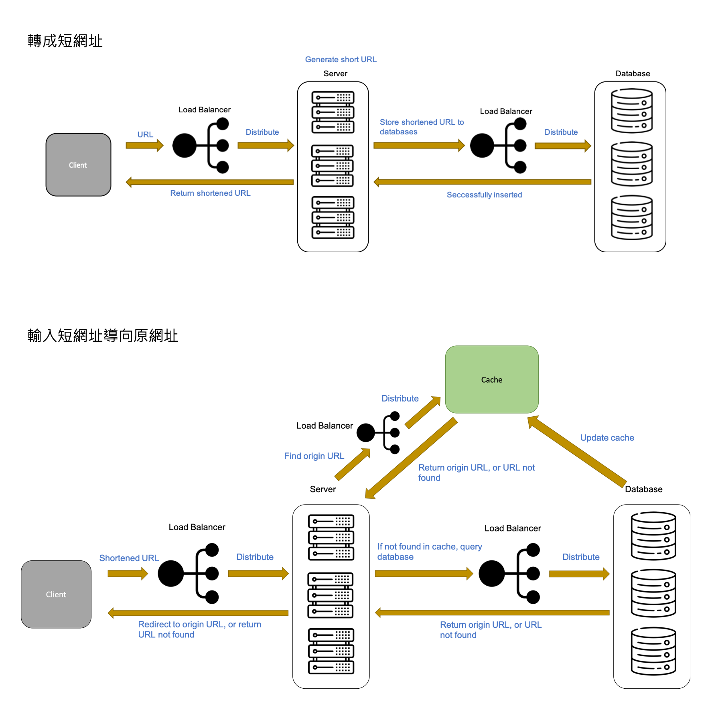

Reference  

1. [系統設計- 設計縮網址服務· jyt0532's Blog](https://www.google.com/url?sa=t&rct=j&q=&esrc=s&source=web&cd=&ved=2ahUKEwi1la7V1-LxAhWlBKYKHdsGAPIQFnoECAUQAA&url=https%3A%2F%2Fwww.jyt0532.com%2F2019%2F12%2F05%2Fdesign-tiny-url%2F&usg=AOvVaw2g4zUtlv6lYo85b2m6cjma)  

2. [短网址(short URL)系统的原理及其实现](https://hufangyun.com/2017/short-url/)

3. [Designing a URL Shortening service like TinyURL](https://www.educative.io/courses/grokking-the-system-design-interview/m2ygV4E81AR)